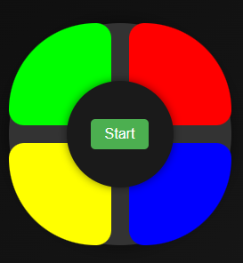

# Timon - Modern Memory Game

<div align="center">



**Une version moderne et élégante du jeu de mémoire classique Simon**

[](https://www.typescriptlang.org/)
[](https://vitejs.dev/)
[](https://opensource.org/licenses/ISC)

[Demo Live](https://gdevweb.github.io/Timon-Memory-Game) • [Reporter un Bug](https://github.com/GDevWeb/Timon-Memory-Game/issues) • [Demander une Fonctionnalité](https://github.com/GDevWeb/Timon-Memory-Game/issues)

</div>

---

## Fonctionnalités

### Gameplay

- **Interface intuitive** : Reproduisez des séquences de couleurs de plus en plus complexes
- **20 niveaux de difficulté** : Défiez votre mémoire jusqu'au niveau maximum
- **Mode strict** : Option pour les joueurs expérimentés

### Expérience Utilisateur

- **Design moderne** : Interface sombre avec dégradés et animations fluides
- **Responsive** : S'adapte parfaitement aux mobiles, tablettes et ordinateurs
- **Effets audio** : Sons distincts pour chaque couleur
- **Animations visuelles** : Feedback immédiat sur chaque action

### Fonctionnalités Avancées

- **Sauvegarde automatique** : Reprenez votre partie où vous l'avez laissée
- **Système de statistiques** : Suivez vos performances
  - Nombre de parties jouées
  - Taux de victoire
  - Meilleur score
  - Niveau moyen
  - Temps de jeu moyen
- **Toast notifications** : Notifications élégantes (fini les `alert()` !)
- **Raccourcis clavier** : Navigation rapide
  - `Espace` : Démarrer/Redémarrer
  - `Ctrl/Cmd + S` : Voir les statistiques
  - `Escape` : Fermer les modals

### Qualité du Code

- **Architecture modulaire** : Code organisé et maintenable
- **TypeScript strict** : Type-safety complète
- **Commentaires JSDoc** : Documentation intégrée
- **Separation of Concerns** : Logique métier séparée de la présentation

---

## Démarrage Rapide

### Prérequis

- Node.js >= 16.0.0
- npm >= 8.0.0

### Installation

```bash
# 1. Cloner le repository
git clone https://github.com/GDevWeb/Timon-Memory-Game.git

# 2. Accéder au dossier
cd Timon-Memory-Game

# 3. Installer les dépendances
npm install

# 4. Lancer le serveur de développement
npm run dev
```

Le jeu sera accessible sur `http://localhost:5173`

### Scripts Disponibles

```bash
npm run dev       # Démarre le serveur de développement avec Vite
npm run build     # Compile le projet pour la production
npm run preview   # Prévisualise le build de production
```

---

## Structure du Projet

```
timon/
├── public/
│   ├── css/
│   │   └── styles.css        # Styles globaux
│   ├── icons/
│   │   └── icon.ico          # Favicon
│   └── images/
│       └── icon.png          # Logo du jeu
├── src/
│   ├── components/
│   │   └── StatsModal.ts     # Modal des statistiques
│   ├── types/
│   │   └── game.ts           # Interfaces TypeScript
│   │   └── gamestate.ts
│   │   └── toast.ts
│   ├── utils/
│   │   ├── analytics.ts      # Système d'analytics
│   │   ├── colors.ts         # Utilitaires couleurs
│   │   ├── domHelpers.ts     # Helpers DOM
│   │   └── sounds.ts         # Gestion audio
│   ├── game.ts               # Logique principale du jeu
│   ├── gameStorage.ts        # Gestion localStorage
│   ├── toast.ts              # Système de notifications
│   ├── index.ts              # Point d'entrée
│   └── vite-env.d.ts         # Types Vite
├── index.html                # Page HTML principale
├── package.json              # Configuration npm
├── tsconfig.json             # Configuration TypeScript
├── vite.config.ts            # Configuration Vite (optionnel)
├── README.md                 # Ce fichier
└── TODO.md                   # Roadmap du projet
```

---

## Comment Jouer

1. **Démarrer** : Cliquez sur "Start" ou appuyez sur `Espace`
2. **Observer** : Regardez la séquence de couleurs qui s'illumine
3. **Reproduire** : Cliquez sur les pads dans le même ordre
4. **Progresser** : Chaque niveau ajoute une nouvelle couleur à la séquence
5. **Gagner** : Atteignez le niveau 20 pour remporter la partie !

### Astuces

- 🎧 Activez le son pour une meilleure expérience
- 📊 Consultez vos statistiques régulièrement
- 💾 Le jeu sauvegarde automatiquement votre progression
- ⌨️ Utilisez les raccourcis clavier pour plus de rapidité

---

## 🛠️ Technologies Utilisées

| Technologie                                                                                                      | Description                          |
| ---------------------------------------------------------------------------------------------------------------- | ------------------------------------ |
|  | Langage principal avec typage strict |
|                    | Build tool ultra-rapide              |
|                 | Structure sémantique                 |
|                    | Styles modernes avec animations      |
|                              | Persistance des données              |

### Architecture

- **Pattern MVC** : Séparation claire des responsabilités
- **OOP** : Classes TypeScript pour une meilleure organisation
- **Modularité** : Chaque fonctionnalité dans son propre module
- **Type Safety** : Interfaces et types stricts partout

---

## 🤝 Contribution

Les contributions sont les bienvenues ! Voici comment vous pouvez aider :

### Prochaines Fonctionnalités (TODO)

- [ ] Mode multijoueur local
- [ ] Thèmes de couleurs personnalisables
- [ ] Niveaux de difficulté (facile, moyen, difficile)
- [ ] Classement en ligne
- [ ] Mode entraînement
- [ ] Support PWA (Progressive Web App)
- [ ] Tests unitaires et E2E
- [ ] i18n (internationalisation)

### Comment Contribuer

1. Fork le projet
2. Créez votre branche (`git checkout -b feature/AmazingFeature`)
3. Committez vos changements (`git commit -m 'Add some AmazingFeature'`)
4. Push vers la branche (`git push origin feature/AmazingFeature`)
5. Ouvrez une Pull Request

---

## Statistiques du Projet


---

## Changelog

### Version 2.0.0 (Actuelle)

- Refonte complète en TypeScript
- Nouveau design moderne
- Système de statistiques intégré
- Sauvegarde automatique avec localStorage
- Toast notifications élégantes
- Raccourcis clavier
- Responsive design amélioré
- Architecture modulaire

### Version 1.0.0

- Gameplay de base
- Interface simple
- Effets sonores

---

## Auteur

**Gaëtan Dammaretz** - _Développeur Web_

- Portfolio : [En construction]
- LinkedIn : [Gaëtan Dammaretz](https://www.linkedin.com/in/gaëtan-dammaretz/)
- GitHub : [@GDevWeb](https://github.com/GDevWeb)
- Email : [Contact](mailto:gaetan.dammaretz.dev@gmail.com)

---

## Licence

Ce projet est sous licence **ISC** - voir le fichier [LICENSE](LICENSE) pour plus de détails.

---

## Remerciements

- Inspiré du jeu classique **Simon** de Milton Bradley
- Sons fournis par [FreeCodeCamp](https://www.freecodecamp.org/)
- Icons et design moderne créés spécialement pour ce projet

---

<div align="center">

**⭐ Si vous aimez ce projet, n'hésitez pas à lui donner une étoile ! ⭐**

Made with ❤️ and ☕ by [GDevWeb](https://github.com/GDevWeb)

</div>
